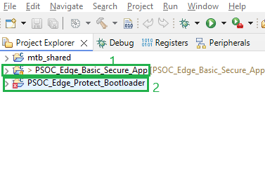
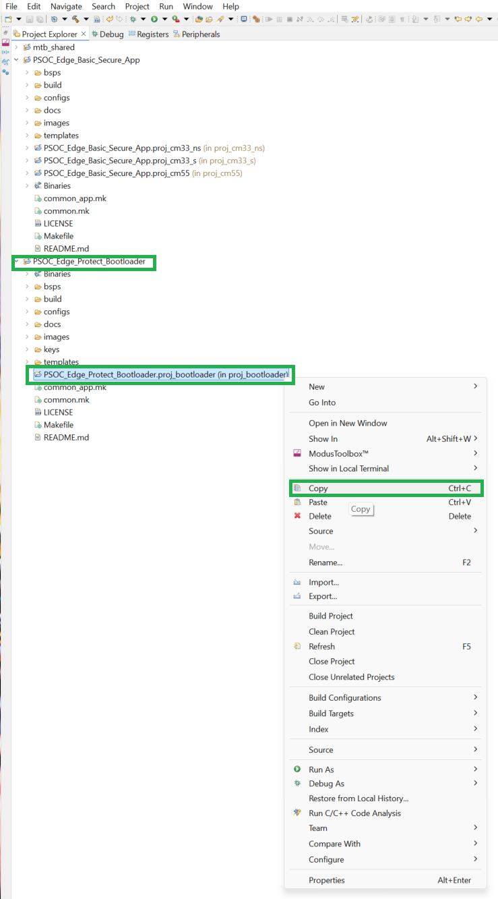
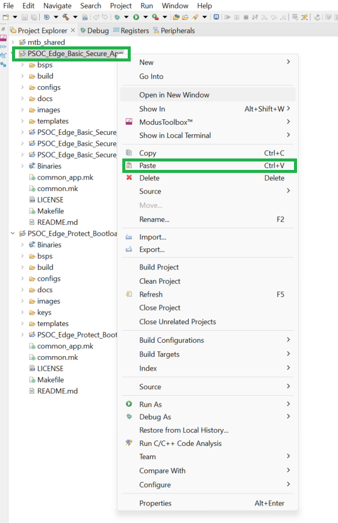
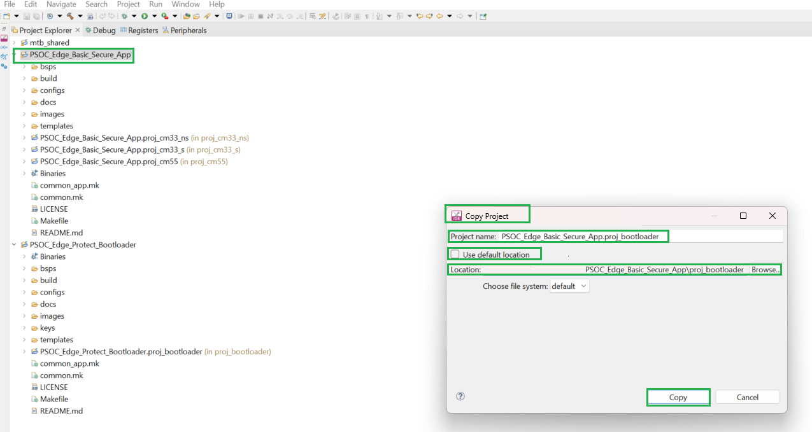
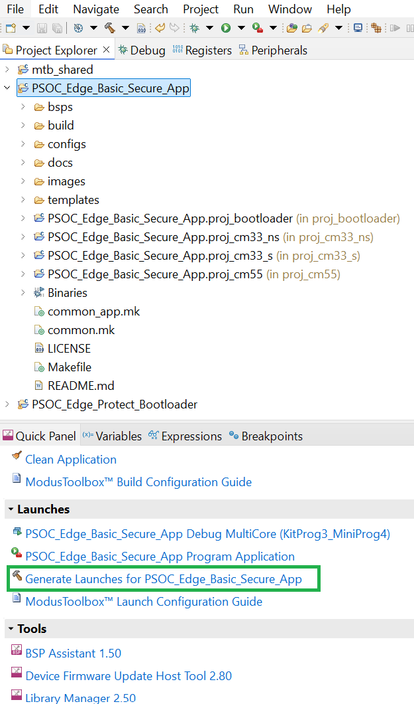
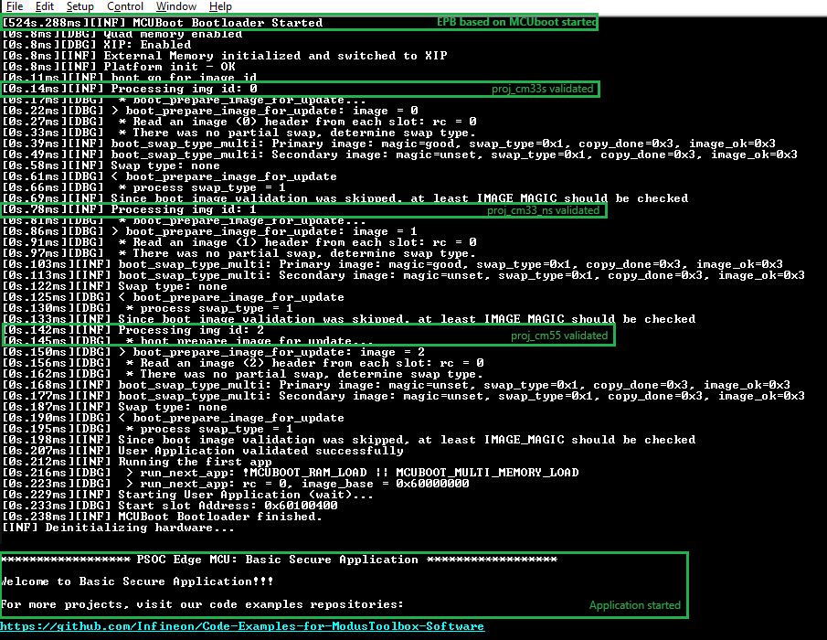
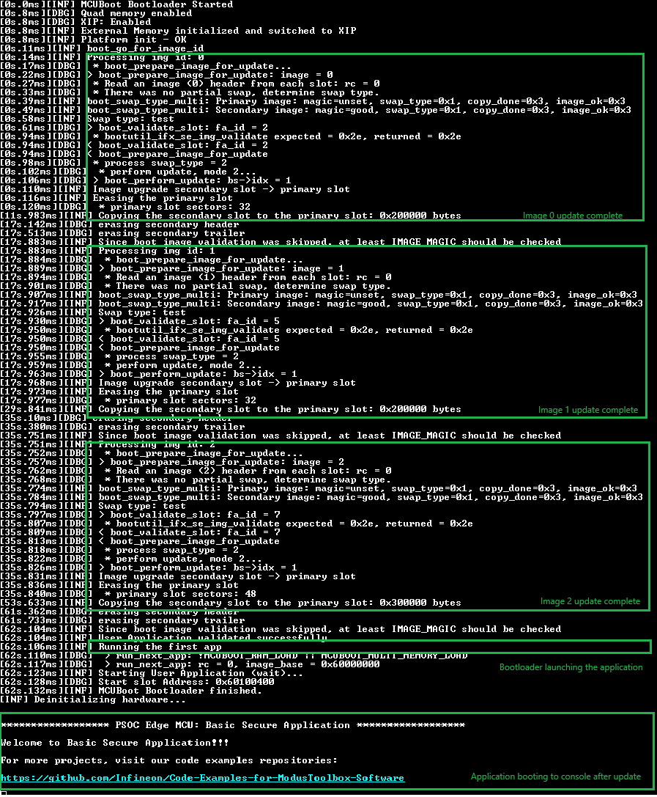

# PSOC&trade; Edge MCU: Edge Protect bootloader

This code example demonstrates the integration of the *PSOC_Edge_Protect_Bootloader* library with a user application or other code examples using PSOC_Edge_Basic_Secure_App as a reference implementation throughout this document. This example demonstrates the usage of PSOC_Edge_Protect_Bootloader on Infineon's PSOC&trade; Edge MCU for secure boot and secure fimware update. 

*PSOC_Edge_Protect_Bootloader* is an open-source MCUboot library based bootloader for Infineon's PSOC&trade; Edge MCU. MCUboot is the primary bootloader in popular IoT operating systems such as Zephyr and Apache Mynewt.

Although the instructions are demonstrated with PSOC_Edge_Basic_Secure_App, they are applicable to other code examples as well.

This code example has a three project structure: CM33 secure, CM33 non-secure, and CM55 projects. All three projects are programmed to the external QSPI flash and executed in Execute in Place (XIP) mode. Extended boot launches the CM33 secure project from a fixed location in the external flash, which then configures the protection settings and launches the CM33 non-secure application. Additionally, CM33 non-secure application enables CM55 CPU and launches the CM55 application.

[View this README on GitHub.](https://github.com/Infineon/mtb-example-edge-protect-bootloader)

[Provide feedback on this code example.](https://cypress.co1.qualtrics.com/jfe/form/SV_1NTns53sK2yiljn?Q_EED=eyJVbmlxdWUgRG9jIElkIjoiQ0UyMzUzNzkiLCJTcGVjIE51bWJlciI6IjAwMi0zNTM3OSIsIkRvYyBUaXRsZSI6IlBTT0MmdHJhZGU7IEVkZ2UgTUNVOiBFZGdlIFByb3RlY3QgYm9vdGxvYWRlciIsInJpZCI6ImRvdmhhbGEiLCJEb2MgdmVyc2lvbiI6IjIuMC4wIiwiRG9jIExhbmd1YWdlIjoiRW5nbGlzaCIsIkRvYyBEaXZpc2lvbiI6Ik1DRCIsIkRvYyBCVSI6IklDVyIsIkRvYyBGYW1pbHkiOiJQU09DIn0=)

## Requirements

- [ModusToolbox&trade;](https://www.infineon.com/modustoolbox) v3.6 or later (tested with v3.6)
- Board support package (BSP) minimum required version for:
   - KIT_PSE84_EVAL_EPC2: v1.0.0
   - KIT_PSE84_EVAL_EPC4: v1.0.0
- Programming language: C
- Associated parts: All [PSOC&trade; Edge E84 MCU](https://www.infineon.com/products/microcontroller/32-bit-psoc-arm-cortex/32-bit-psoc-edge-arm/psoc-edge-e84) parts

## Supported toolchains (make variable 'TOOLCHAIN')

- GNU Arm&reg; Embedded Compiler v14.2.1 (`GCC_ARM`) – Default value of `TOOLCHAIN`
- Arm&reg; Compiler v6.22 (`ARM`)
- IAR C/C++ Compiler v9.50.2 (`IAR`)

## Supported kits (make variable 'TARGET')

- **PSOC&trade; Edge E84 Evaluation Kit** (Minimum required revision: Rev *D) <br>
    - [PSOC&trade; Edge E84 Evaluation Kit](https://www.infineon.com/KIT_PSE84_EVAL) (`KIT_PSE84_EVAL_EPC2`) – Default value of `TARGET`
    - [PSOC&trade; Edge E84 Evaluation Kit](https://www.infineon.com/KIT_PSE84_EVAL) (`KIT_PSE84_EVAL_EPC4`)

## Hardware setup

See the kit user guide to ensure that the board is configured correctly to boot from the RRAM location.

Ensure the following jumper and pin configuration on board.
- Ensure BOOT SW should be in LOW/OFF position
- Ensure J20 and J21 should be in tristate/not connected (NC) position

> **Note:** This code example expects the device to be in DEVELOPMENT LCS and secure_boot disabled to get started. If you have just unboxed the device, it is already in DEVELOPMET LCS with secure_boot disabled. In case if you have already enabled secure boot, revert back your changes (disable secure boot in policy and provision the device) to get started with this code example.


## Software setup

See the [ModusToolbox&trade; tools package installation guide](https://www.infineon.com/ModusToolboxInstallguide) for information about installing and configuring the tools package.

Install a terminal emulator if you do not have one. Instructions in this document use [Tera Term](https://teratermproject.github.io/index-en.html).
 
Edge Protect tools: Install Edge Protect Security Suite v1.6 or later. 
  - See [Getting started with PSOC Edge E84 on ModusToolbox software](https://www.infineon.com/AN235935) for detailed installation instructions


## Getting Started with PSOC_Edge_Protect_Bootloader

PSOC_Edge_Protect_Bootloader is configured to run from RRAM by default. Using the default configuration is the easiest way to get started. 

On power on, secure enclave starts first, which then launches the extended boot on the CM33 CPU. Extended boot is responsible for launching the first user code. In this code examples, PSOC_Edge_Protect_Bootloader is the first user code followed by the application of your choice such as "Hello world" and PSOC_Edge_Basic_Secure_App code examples.

In order to experience the full bootchain with PSOC_Edge_Protect_Bootloader, add Edge Protect bootlaoder to an existing application. This example uses the PSOC_Edge_Basic_Secure_App code example as the reference starting point. To use the Bootloader with an application, perform the following: 

   1. Create PSOC_Edge_Basic_Secure_App and PSOC_Edge_Protect_Bootloader code examples
   2. Add Edge Protect bootloder to PSOC_Edge_Basic_Secure_App code example
   3. Configure the Memory Map and Makefiles  
   4. Build, program, and run

Follow the detailed steps given in the [Operation](#Operation) section below.

## Operation

### Create PSOC_Edge_Protect_Bootloader

1. Create the **PSOC_Edge_Protect_Bootloader** code example. See [Using the code example](docs/using_the_code_example.md) for instructions on creating a project and opening it in various supported IDEs.

### Create PSOC_Edge_Basic_Secure_App

2. If you have already created the PSOC_Edge_Basic_Secure_App code example, you can skip this step. If you have not created it yet, see [Using the code example](docs/using_the_code_example.md) for instructions on creating a project and opening it in various supported IDEs. 

Now, you should see both **PSOC_Edge_Protect_Bootloader** and **PSOC_Edge_Basic_Secure_App** code example in the **Project Explorer** of your IDE as shown in **Figure 1**

**Figure 1: Creating Applications**



#### Add PSOC_Edge_Protect_Bootloader to PSOC_Edge_Basic_Secure_App

To facilitate a seamless usage of **PSOC_Edge_Basic_Secure_App** and the **PSOC_Edge_Protect_Bootloader**, it is essential that the **PSOC_Edge_Protect_Bootloader** possesses a comprehensive understanding of the PSOC_Edge_Basic_Secure_App's configuration parameters such as its location and size. 

   To establish this connection, **PSOC_Edge_Protect_Bootloader** must be imported as a project within the **PSOC_Edge_Basic_Secure_App**. The subsequent instructions will provide a detailed walkthrough of this integration process.

3. In **File explorer**, navigate to the workspace or directory where you have created **PSOC_Edge_Basic_Secure_App** and **PSOC_Edge_Protect_Bootloader** applications.  

4. Copy the *proj_bootloader* from **PSOC_Edge_Protect_Bootloader** to the root of **PSOC_Edge_Basic_Secure_App** as shown below

**Figure 2: Copy Bootloader**



**Figure 3: Paste Bootloader**




5. While copying, *copy project* window will appear as shown below. Change the Projet Name to *PSOC_Edge_Basic_Secure_App.proj_bootloader*. Uncheck the *Use Default location*, and select the path to *PSOC_Edge_Basic_Secure_App*. Append *\proj_bootloader* to the path as shown and then click on *copy* button.

**Figure 4: Rename Project while copying**




6. Select the application *PSOC_Edge_Basic_Secure_App*, navigate to quick panel and genarte the launch configurations as shown below.

**Figure 5: Generate Launch Configs**




**Note:** Above steps refer to *PSOC_Edge_Basic_Secure_App*. However the process of adding Bootloader to other application is identical, with a difference that wherever you have *PSOC_Edge_Basic_Secure_App*, you should select your application.

7. Updated the *Makefile*: Open the *Makefile* in the root of the **PSOC_Edge_Basic_Secure_App** and add `proj_bootloader` to `MTB_PROJECTS` variable as shown here:

    ``` 
   MTB_PROJECTS=proj_cm33_s proj_cm33_ns proj_cm55 proj_bootloader
   ```

#### Configure the Memory Map and Makefiles  

The PSOC_Edge_Basic_Secure_App code example bundles a custom *design.modus* file compatible with PSOC_Edge_Protect_Bootloader. Hence, you need not make any further customizations here to use PSOC_Edge_Edge_Protect_Bootloader and PSOC_Edge_Basic_Secure_App together.

8. Open *common.mk* in the root of the application and update *COMBINE_SIGN_JSON* to *boot_with_bldr.json* generated by the configurator and save the file.

   ```
   COMBINE_SIGN_JSON?=./bsps/TARGET_$(TARGET)/config/GeneratedSource/boot_with_bldr.json
   ```

#### Build, program, and run 

9. Connect the board to your PC using the provided USB cable through the KitProg3 USB connector

10. Open a terminal program and select the KitProg3 COM port. Set the serial port parameters to 8N1 and 115200 baud

11. See [Using the code example](docs/using_the_code_example.md) for instructions on opening it in various supported IDEs, and performing tasks, such as building, programming, and debugging the application within the respective IDEs
 
12. Observe the console logs and confirm the bootloader has started and application has been launched by the bootloader

**Figure 7: Application boot**




#### Perform updates

13. Open *common.mk* in the root of the application and update *COMBINE_SIGN_JSON* to *boot_with_bldr_upgr.json* generated by the configurator and save the file

   ```
   COMBINE_SIGN_JSON?=./bsps/TARGET_$(TARGET)/config/GeneratedSource/boot_with_bldr_upgr.json
   ```

14. See [Using the code example](docs/using_the_code_example.md) for instructions on opening it in various supported IDEs and performing tasks such as building, programming, and debugging the application within the respective IDEs

> **Note:** 

> 1. In this step, images are built for execution from primary slot, but they are programmed to respective secondary slot. For details of primary and secondary slots, visit the **Memory** and **Solution** tabs in the Device Configurator. Upon successful programming, the device resets and Edge Protect bootloader starts the execution. The bootloader then copies images from the secondary slot to primary slot and launches the application

> 2. Default configurator of this code example demonstrates updating with the overwrite mode

15. Observe the console logs and confirm bootloader has started and the application has been launched by the bootloader

**Figure 8: Application update**




## Use othe bootloader capabilities

*PSOC_Edge_Protect_Bootloader* provides several other capabilities including secured boot, secured updated with overwrite and swap, encrypted boot, and loading application to SRAM, etc. Utilize the self-help resources provided through the Bootloader Solution Personality feature, accessible within the Device Configurator UI, for guidance.

## Bootloader integration with LLVM-compiled applications

The Edge Protect bootloader is not compatible with the LLVM compiler. However, when you add the Bootloader to a code example that utilizes the LLVM compiler, the Bootloader will also be configured to build with LLVM. To resolve this issue, manually override the compiler option in the Bootloader’s *Makefile*, as shown here: 

```
TOOLCHAIN=<GCC_ARM> or <ARM> or <IAR>
```

By configuring the Bootloader to use a custom compiler, it will be compiled separately while the application continues to build with the selected LLVM compiler specified in the *common.mk* file.


## Related resources

Resources  | Links
-----------|----------------------------------
Application notes  | [AN235935](https://www.infineon.com/AN235935) – Getting started with PSOC&trade; Edge E84 MCU on ModusToolbox&trade; software
Code examples  | [Using ModusToolbox&trade;](https://github.com/Infineon/Code-Examples-for-ModusToolbox-Software) on GitHub
Device documentation | [PSOC&trade; Edge E84 MCU datasheet](https://www.infineon.com/products/microcontroller/32-bit-psoc-arm-cortex/32-bit-psoc-edge-arm/psoc-edge-e84#Documents) <br> [PSOC&trade; Edge E84 MCU reference manuals](https://www.infineon.com/products/microcontroller/32-bit-psoc-arm-cortex/32-bit-psoc-edge-arm/psoc-edge-e84#Documents)
Development kits | Select your kits from the [Evaluation board finder](https://www.infineon.com/cms/en/design-support/finder-selection-tools/product-finder/evaluation-board)
Libraries  | [mtb-dsl-pse8xxgp](https://github.com/Infineon/mtb-dsl-pse8xxgp) – Device support library for PSE8XXGP <br> [retarget-io](https://github.com/Infineon/retarget-io) – Utility library to retarget STDIO messages to a UART port
Tools  | [ModusToolbox&trade;](https://www.infineon.com/modustoolbox) – ModusToolbox&trade; software is a collection of easy-to-use libraries and tools enabling rapid development with Infineon MCUs for applications ranging from wireless and cloud-connected systems, edge AI/ML, embedded sense and control, to wired USB connectivity using PSOC&trade; Industrial/IoT MCUs, AIROC&trade; Wi-Fi and Bluetooth&reg; connectivity devices, XMC&trade; Industrial MCUs, and EZ-USB&trade;/EZ-PD&trade; wired connectivity controllers. ModusToolbox&trade; incorporates a comprehensive set of BSPs, HAL, libraries, configuration tools, and provides support for industry-standard IDEs to fast-track your embedded application development

<br>


## Other resources

Infineon provides a wealth of data at [www.infineon.com](https://www.infineon.com) to help you select the right device, and quickly and effectively integrate it into your design.


## Document history

Document title: *CE235379* – *PSOC&trade; Edge MCU: Egde Protect bootloader*

 Version | Description of change
 ------- | ---------------------
 1.x.0   | New code example <br> Early access release
 2.0.0   | GitHub release
<br>


All referenced product or service names and trademarks are the property of their respective owners.

The Bluetooth&reg; word mark and logos are registered trademarks owned by Bluetooth SIG, Inc., and any use of such marks by Infineon is under license.

PSOC&trade;, formerly known as PSoC&trade;, is a trademark of Infineon Technologies. Any references to PSoC&trade; in this document or others shall be deemed to refer to PSOC&trade;.

---------------------------------------------------------

© Cypress Semiconductor Corporation, 2025. This document is the property of Cypress Semiconductor Corporation, an Infineon Technologies company, and its affiliates ("Cypress").  This document, including any software or firmware included or referenced in this document ("Software"), is owned by Cypress under the intellectual property laws and treaties of the United States and other countries worldwide.  Cypress reserves all rights under such laws and treaties and does not, except as specifically stated in this paragraph, grant any license under its patents, copyrights, trademarks, or other intellectual property rights.  If the Software is not accompanied by a license agreement and you do not otherwise have a written agreement with Cypress governing the use of the Software, then Cypress hereby grants you a personal, non-exclusive, nontransferable license (without the right to sublicense) (1) under its copyright rights in the Software (a) for Software provided in source code form, to modify and reproduce the Software solely for use with Cypress hardware products, only internally within your organization, and (b) to distribute the Software in binary code form externally to end users (either directly or indirectly through resellers and distributors), solely for use on Cypress hardware product units, and (2) under those claims of Cypress's patents that are infringed by the Software (as provided by Cypress, unmodified) to make, use, distribute, and import the Software solely for use with Cypress hardware products.  Any other use, reproduction, modification, translation, or compilation of the Software is prohibited.
<br>
TO THE EXTENT PERMITTED BY APPLICABLE LAW, CYPRESS MAKES NO WARRANTY OF ANY KIND, EXPRESS OR IMPLIED, WITH REGARD TO THIS DOCUMENT OR ANY SOFTWARE OR ACCOMPANYING HARDWARE, INCLUDING, BUT NOT LIMITED TO, THE IMPLIED WARRANTIES OF MERCHANTABILITY AND FITNESS FOR A PARTICULAR PURPOSE.  No computing device can be absolutely secure.  Therefore, despite security measures implemented in Cypress hardware or software products, Cypress shall have no liability arising out of any security breach, such as unauthorized access to or use of a Cypress product. CYPRESS DOES NOT REPRESENT, WARRANT, OR GUARANTEE THAT CYPRESS PRODUCTS, OR SYSTEMS CREATED USING CYPRESS PRODUCTS, WILL BE FREE FROM CORRUPTION, ATTACK, VIRUSES, INTERFERENCE, HACKING, DATA LOSS OR THEFT, OR OTHER SECURITY INTRUSION (collectively, "Security Breach").  Cypress disclaims any liability relating to any Security Breach, and you shall and hereby do release Cypress from any claim, damage, or other liability arising from any Security Breach.  In addition, the products described in these materials may contain design defects or errors known as errata which may cause the product to deviate from published specifications. To the extent permitted by applicable law, Cypress reserves the right to make changes to this document without further notice. Cypress does not assume any liability arising out of the application or use of any product or circuit described in this document. Any information provided in this document, including any sample design information or programming code, is provided only for reference purposes.  It is the responsibility of the user of this document to properly design, program, and test the functionality and safety of any application made of this information and any resulting product.  "High-Risk Device" means any device or system whose failure could cause personal injury, death, or property damage.  Examples of High-Risk Devices are weapons, nuclear installations, surgical implants, and other medical devices.  "Critical Component" means any component of a High-Risk Device whose failure to perform can be reasonably expected to cause, directly or indirectly, the failure of the High-Risk Device, or to affect its safety or effectiveness.  Cypress is not liable, in whole or in part, and you shall and hereby do release Cypress from any claim, damage, or other liability arising from any use of a Cypress product as a Critical Component in a High-Risk Device. You shall indemnify and hold Cypress, including its affiliates, and its directors, officers, employees, agents, distributors, and assigns harmless from and against all claims, costs, damages, and expenses, arising out of any claim, including claims for product liability, personal injury or death, or property damage arising from any use of a Cypress product as a Critical Component in a High-Risk Device. Cypress products are not intended or authorized for use as a Critical Component in any High-Risk Device except to the limited extent that (i) Cypress's published data sheet for the product explicitly states Cypress has qualified the product for use in a specific High-Risk Device, or (ii) Cypress has given you advance written authorization to use the product as a Critical Component in the specific High-Risk Device and you have signed a separate indemnification agreement.
<br>
Cypress, the Cypress logo, and combinations thereof, ModusToolbox, PSoC, CAPSENSE, EZ-USB, F-RAM, and TRAVEO are trademarks or registered trademarks of Cypress or a subsidiary of Cypress in the United States or in other countries. For a more complete list of Cypress trademarks, visit www.infineon.com. Other names and brands may be claimed as property of their respective owners.
