# PSOC&trade; Edge MCU: Edge Protect Bootloader

**PSOC_Edge_Protect_Bootloader** is an open-source MCUboot library-based bootloader for Infineon's PSOC&trade; Edge MCU. MCUboot is the primary bootloader in popular IoT operating systems, such as Zephyr and Apache Mynewt.

**PSOC_Edge_Protect_Bootloader** supports secure boot and secure firmware update features using either ECDSA P-256 and PQC (ML-DSA-87) algorithms. It also supports several other features supported by the open-source MCUboot library on Infineon's PSOC&trade; Edge MCU. 

This document demonstrates the integration of the **PSOC_Edge_Protect_Bootloader** with a reference user application such as **PSOC_Edge_Basic_Secure_App**. It demonstrates the usage of **PSOC_Edge_Protect_Bootloader** code example to enable secure boot and secure firmware update features.

While the instructions in this document use **PSOC_Edge_Basic_Secure_App** as an example, they also apply to other use cases involving secure boot or secure update. You can easily integrate Edge Protect Bootlaoder into any code example by following the instructions documented for this example.
> **Note:** On the KIT_PSE84_HMI, all three projects are programmed to the external OSPI flash instead of QSPI.

[View this README on GitHub.](https://github.com/Infineon/mtb-example-edge-protect-bootloader)

[Provide feedback on this code example.](https://yourvoice.infineon.com/jfe/form/SV_1NTns53sK2yiljn?Q_EED=eyJVbmlxdWUgRG9jIElkIjoiQ0UyMzUzNzkiLCJTcGVjIE51bWJlciI6IjAwMi0zNTM3OSIsIkRvYyBUaXRsZSI6IlBTT0MmdHJhZGU7IEVkZ2UgTUNVOiBFZGdlIFByb3RlY3QgQm9vdGxvYWRlciIsInJpZCI6ImFydGVtLmRvdmhhbEBpbmZpbmVvbi5jb20iLCJEb2MgdmVyc2lvbiI6IjIuNC4wIiwiRG9jIExhbmd1YWdlIjoiRW5nbGlzaCIsIkRvYyBEaXZpc2lvbiI6Ik1DRCIsIkRvYyBCVSI6IklDVyIsIkRvYyBGYW1pbHkiOiJQU09DIn0=)


## Requirements

- [ModusToolbox&trade;](https://www.infineon.com/modustoolbox) v3.8 or later (tested with v3.8)
- Board support package (BSP) minimum required version for:
   - KIT_PSE84_EVAL_EPC2: v1.0.0
   - KIT_PSE84_EVAL_EPC4: v1.0.0
   - KIT_PSE84_AI: v1.0.0
   - KIT_PSE84_HMI: v1.3.0

- Programming language: C
- Associated parts: All [PSOC&trade; Edge E84 MCU](https://www.infineon.com/products/microcontroller/32-bit-psoc-arm-cortex/32-bit-psoc-edge-arm/psoc-edge-e84) parts


## Supported toolchains (make variable 'TOOLCHAIN')

- GNU Arm&reg; Embedded Compiler v14.2.1 (`GCC_ARM`) – Default value of `TOOLCHAIN`
- Arm&reg; Compiler v6.22 (`ARM`)
- IAR C/C++ Compiler v9.50.2 (`IAR`)

## Supported kits (make variable 'TARGET')

- **PSOC&trade; Edge E84 Evaluation Kit** (minimum required revision: Rev *D) <br>
    - [PSOC&trade; Edge E84 Evaluation Kit](https://www.infineon.com/KIT_PSE84_EVAL) (`KIT_PSE84_EVAL_EPC2`) – Default value of `TARGET`
    - [PSOC&trade; Edge E84 Evaluation Kit](https://www.infineon.com/KIT_PSE84_EVAL) (`KIT_PSE84_EVAL_EPC4`)
    - [PSOC&trade; Edge E84 AI Kit](https://www.infineon.com/KIT_PSE84_AI) (`KIT_PSE84_AI`)
    - [PSOC&trade; Edge E84 HMI Kit](https://www.infineon.com/KIT_PSE84_HMI) (`KIT_PSE84_HMI`)


## Hardware setup

See the kit user guide to ensure that the board is configured correctly to boot from the RRAM location.

Ensure the following jumper and pin configuration on board.
- BOOT SW must be in the LOW/OFF position
- J20 and J21 must be in the tristate/not connected (NC) position for the PSOC&trade; Edge E84 Evaluation Kit

For the `KIT_PSE84_AI` kit, either remove the R188 resistor and populate the R187 resistor to pull the boot pin to LOW, or follow the provisioning method in the [Provisioning method](#provisioning-method-for-kit_pse84_ai-only)) section to avoid hardware rework.

> **Note:** To evaluate the other supported code examples that boot from QSPI flash, the resistors should be reverted to default settings.

> **Note:** To start this code example, the device should be in DEVELOPMENT LCS and secure_boot disabled. If you have just unboxed the device, it is already in DEVELOPMENT LCS with secure_boot disabled. In case if you have already enabled secure boot, revert back your changes (disable secure boot in policy and provision the device).

## Provisioning method (for KIT_PSE84_AI only)

To avoid hardware rework on the `KIT_PSE84_AI` kit, customize the generated OEM policy JSON file to ignore the boot pin status while booting.

While following the provisioning steps, once the OEM key pair is generated, set the 'oem_alt_boot' to "false" in the *policy/policy_oem_provisioning.json* file in the project before provisioning the kit.

For detailed instructions to provision the kit, see the *Development flow* section in the [AN237849 – Getting started with PSOC&trade; Edge security](https://www.infineon.com/AN237849).

> **Note:** To evaluate other code examples that boot from QSPI flash, reprovision the kit with default settings by setting 'oem_alt_boot' to "true" in the *policy/policy_oem_provisioning.json* file in the project before reprovisioning the kit.

## Software setup

See the [ModusToolbox&trade; tools package installation guide](https://www.infineon.com/ModusToolboxInstallguide) for information about installing and configuring the tools package.

- Install a terminal emulator if you do not have one. Instructions in this document use [Tera Term](https://teratermproject.github.io/index-en.html)
 
- Edge Protect Tools: Install Edge Protect Security Suite v1.6 or later. See [Getting started with PSOC&trade; Edge E8 MCU on ModusToolbox&trade; software](https://www.infineon.com/AN235935) for detailed installation instructions


## Getting started with PSOC_Edge_Protect_Bootloader

*PSOC_Edge_Protect_Bootloader* is configured to run from RRAM by default. Using the default configuration is the easiest way to get started. 

On power on, Secure Enclave starts first, which then launches the Extended Boot on the CM33 CPU. Extended Boot is responsible for launching the first user code. In this code example, *PSOC_Edge_Protect_Bootloader* is the first user code followed by the application of your choice, such as [Hello world](https://github.com/Infineon/mtb-example-psoc-edge-hello-world) or [PSOC_Edge_Basic_Secure_App](https://github.com/Infineon/mtb-example-psoc-edge-basic-secure-app) code examples.

To experience the full bootchain with *PSOC_Edge_Protect_Bootloader*, add Edge Protect Bootloader to an existing application. This example uses the *PSOC_Edge_Basic_Secure_App* code example as the reference starting point. To use the bootloader with an application, perform the following: 

1. Create [PSOC_Edge_Basic_Secure_App](https://github.com/Infineon/mtb-example-psoc-edge-basic-secure-app) and PSOC_Edge_Protect_Bootloader code examples
2. Add Edge Protect Bootloader to PSOC_Edge_Basic_Secure_App code example
3. Configure the Memory Map and Makefiles  
4. Build, program, and run

For detailed steps refer the [Operation](#operation) section.

## Operation

### Create PSOC_Edge_Protect_Bootloader
1. Create the *PSOC_Edge_Protect_Bootloader* code example. See [Using the code example](docs/using_the_code_example.md) for instructions on creating a project and opening it in various supported IDEs

### Create PSOC_Edge_Basic_Secure_App
2. If you have already created the *PSOC_Edge_Basic_Secure_App* code example, you can skip this step. If you have not created it yet, see [Using the code example](docs/using_the_code_example.md) for instructions on creating a project and opening it in various supported IDEs

   Now, you can see both **PSOC_Edge_Protect_Bootloader** and **PSOC_Edge_Basic_Secure_App** code examples in the **Project Explorer** of your IDE as shown in **Figure 1**

   **Figure 1. Creating applications**

   

#### Add PSOC_Edge_Protect_Bootloader to PSOC_Edge_Basic_Secure_App
   To facilitate a seamless usage of **PSOC_Edge_Basic_Secure_App** and **PSOC_Edge_Protect_Bootloader**, it is essential that the **PSOC_Edge_Protect_Bootloader** possesses a comprehensive understanding of the PSOC_Edge_Basic_Secure_App's configuration parameters, such as its location and size

   To establish this connection, import **PSOC_Edge_Protect_Bootloader** as a project within the **PSOC_Edge_Basic_Secure_App**. The subsequent instructions will provide a detailed walkthrough of this integration process

3. In **File Explorer**, navigate to the workspace or directory where you have created **PSOC_Edge_Basic_Secure_App** and **PSOC_Edge_Protect_Bootloader** applications

4. Copy the *proj_bootloader* from **PSOC_Edge_Protect_Bootloader** to the root of **PSOC_Edge_Basic_Secure_App** as shown in **Figure 2** and **Figure 3**

   **Figure 2. Copy bootloader**

   

   **Figure 3. Paste bootloader**

   

5. While copying, the **Copy Project** window will display as shown in **Figure 4**. Change the Project Name to **PSOC_Edge_Basic_Secure_App.proj_bootloader**. Uncheck the **Use default location** and select the path to **PSOC_Edge_Basic_Secure_App**. Append *\proj_bootloader* to the path as shown in **Figure 4** and then click **Copy**

   **Figure 4. Rename project while copying**

   

6. Select the *PSOC_Edge_Basic_Secure_App* application, navigate to Quick Panel and generate the launch configurations as shown in **Figure 5**

   **Figure 5. Generate launch configurations**

   

   > **Note:** Earlier steps refer to *PSOC_Edge_Basic_Secure_App*. However, the process of adding a bootloader to other application is same, with a difference that wherever you have *PSOC_Edge_Basic_Secure_App*, you must select your application

7. Update the *Makefile*. Open *Makefile* in the root of the **PSOC_Edge_Basic_Secure_App** and add `proj_bootloader` to `MTB_PROJECTS` variable as follows:

   ``` 
   MTB_PROJECTS=proj_cm33_s proj_cm33_ns proj_cm55 proj_bootloader
   ```

#### Configure the Memory Map and Makefiles
   The **PSOC_Edge_Basic_Secure_App** code example bundles a custom *design.modus* file compatible with **PSOC_Edge_Protect_Bootloader**. Therefore, do not make any further customizations here to use **PSOC_Edge_Edge_Protect_Bootloader** and **PSOC_Edge_Basic_Secure_App** together.

8. Open *common.mk* in the root of the application and update *COMBINE_SIGN_JSON* to *boot_with_bldr.json* generated by the configurator and save the file

   ```
   COMBINE_SIGN_JSON?=./bsps/TARGET_$(TARGET)/config/GeneratedSource/boot_with_bldr.json
   ```

#### Build, program, and run 
9. Connect the board to your PC using the provided USB cable through the KitProg3 USB connector

10. Open a terminal program and select the KitProg3 COM port. Set the serial port parameters to 8N1 and 115200 baud

11. See [Using the code example](docs/using_the_code_example.md) for instructions on opening it in various supported IDEs, and performing tasks, such as building, programming, and debugging the application within the respective IDEs
 
12. Observe the console logs and confirm that the bootloader has started and the application has been launched by the bootloader

    **Figure 6. Application boot**

    

#### Enabling secure boot of Edge Protect Bootloader by Extended boot

1. For complete chain of trust , secure boot must be enabled in the Extended boot through policy file provisioning. Follow the instructions in **PSOC_Edge_Basic_Secure_App** README.md file to provision and enable secure boot in policy.

2. In **PSOC_Edge_Basic_Secure_App** , open the *Device Configurator* --> *Solutions* --> *Bootloader Solution Paramaters* , and enable the signing of the bootloader image as shown in **Figure 7**

 **Figure 7. Enable signing of bootloader image**

 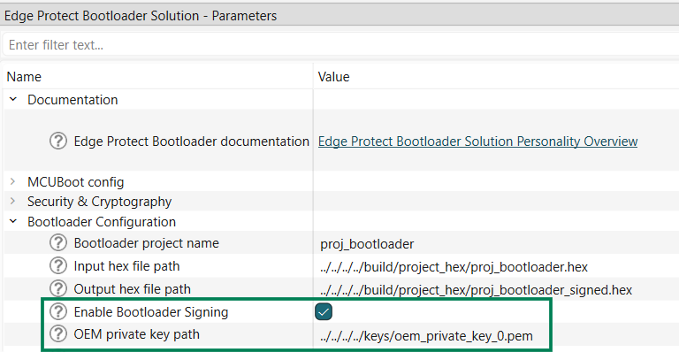


#### Secure boot with Edge Protect Bootloader using PQC (ML-DSA-87) 

For enabling the secure boot of user application by Edge Protect Bootloader, follow the steps below

##### Generate ML-DSA key pair

1. Open modus-shell terminal and navigate to the **PSOC_Edge_Basic_Secure_App** application root directory
2. Execute the following commands to generate the ML-DSA keys using Edge Protect Tools 

```
edgeprotecttools create-key --key-type ML-DSA-87 --output keys/ml_dsa_key_private.der keys/ml_dsa_key_public.der --format DER
```

##### Configure Edge Protect Bootloader to use the ML-DSA keys for secure boot and secure firmware update

1. Open the ModusToolbox&trade; Device Configurator, and click on the Solutions tab.
2. Under the *Edge Protect Bootloader Solution- Parameters* window, make the following changes <br>
   a. Under *MCUBoot config* , enable *Validate boot slot* and *Validate upgrade slot*.

   **Figure 8. Enable image validation**

   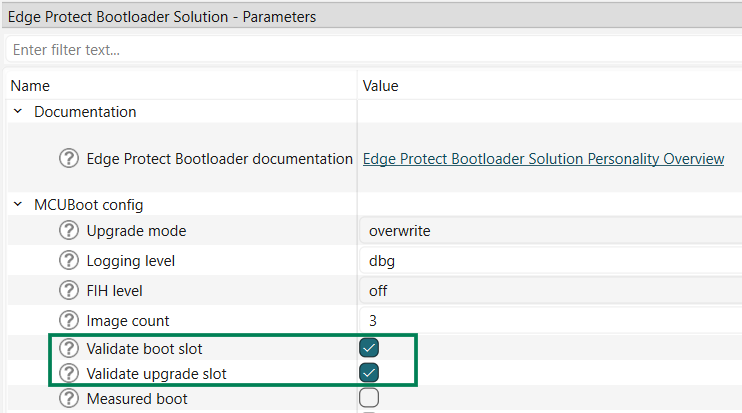

   b. Under *Security & Cryptography* , choose the Signature verification algorithm as *ML-DSA-87 (Dlithium5)*

    **Figure 9. Select signature algorithm**

   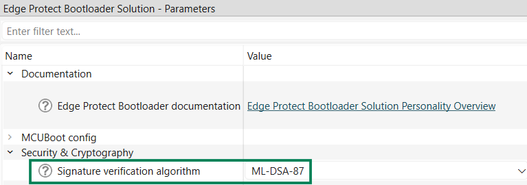

   C. Under *Bootloader Configuration*, provide the path to the public key to be used for signature verification

    **Figure 10. Path to public key**

   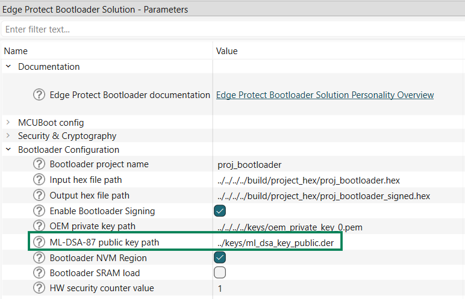

   d. For each application's signing , provide the path to the corresponding private key as shown in the images below 
    
      **Note** Project 0 refers to proj_cm33_s , project 1 refers to proj_cm33_ns , and project 2 refers to proj_cm55.

    **Figure 11. Project 0 sigining key**

   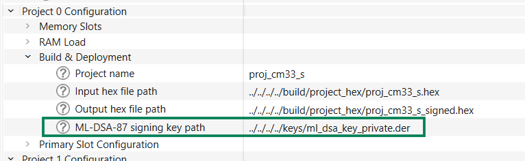

    **Figure 12. Project 1 sigining key**

   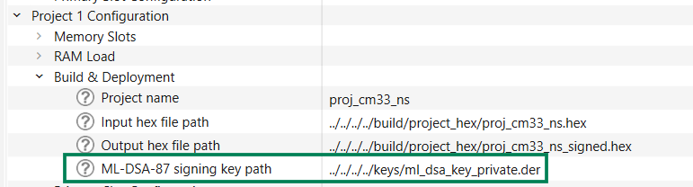

    **Figure 13. Project 2 sigining key**

   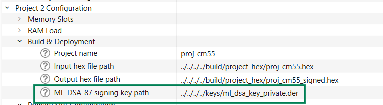      

3. Save the changes to configurator.

4. To add signature to the application images, ensure the `COMBINE_SIGN_JSON` in the *common.mk* file of the application and update the value for the `COMBINE_SIGN_JSON` variable as below.

    The *common.mk* file is located in the top-level directory of your application.

    ```
    COMBINE_SIGN_JSON?=bsps/TARGET__$(TARGET)/config/GeneratedSource/boot_with_bldr.json
    ```

5. Build and program the application

6. Observe the Edge Protect Bootloader (EPB) logs on the UART terminal ( Scroll up in terminal window to see the EPB logs)

**Figure 14. EPB logs for secure boot with PQC**

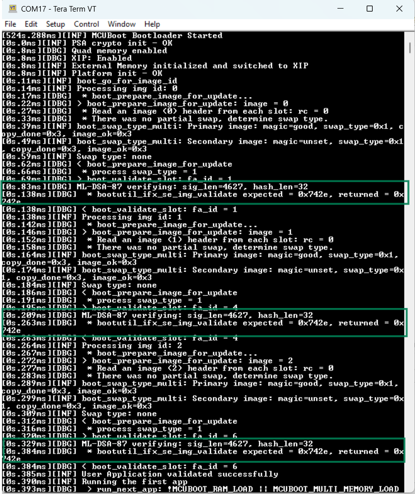  

#### Perform secure firmware update with Edge Protect Bootloader

1. After configuring and programming the boot image as described in the [secure boot](#secure-boot-with-edge-protect-bootloader-using-pqc-ml-dsa-87) section follow the steps below.

2. Open *common.mk* in the root of the application and update *COMBINE_SIGN_JSON* to *boot_with_bldr_upgr.json* generated by the configurator and save the file

     ```
     COMBINE_SIGN_JSON?=./bsps/TARGET_$(TARGET)/config/GeneratedSource/boot_with_bldr_upgr.json
     ```

2. See [Using the code example](docs/using_the_code_example.md) for instructions on opening it in various supported IDEs and performing tasks such as building, programming, and debugging the application within the respective IDEs

    > **Note:** 

     - In this step, images are compiled for execution from the primary slot, but they are programmed to the respective secondary slot. For details of primary and secondary slots, visit the **Memory** and **Solution** tabs in the Device Configurator. Upon successful programming, the device resets and the Edge Protect Bootloader starts the execution. The bootloader then copies images from the secondary slot to the primary slot and launches the application

     - The default configurator of this code example demonstrates updating with the overwrite mode

3. Observe that the console logs and confirm that the bootloader has started and the application has been launched by the bootloader

    **Figure 15. Application update**

    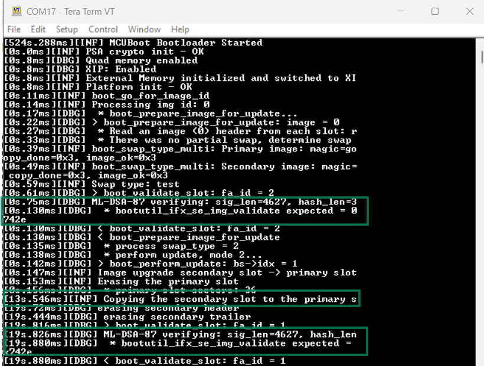

    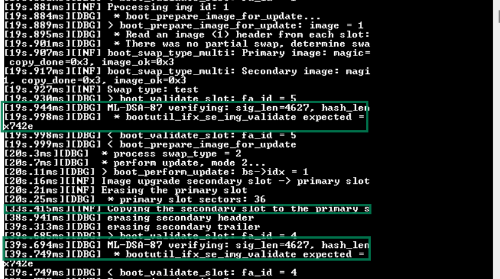

    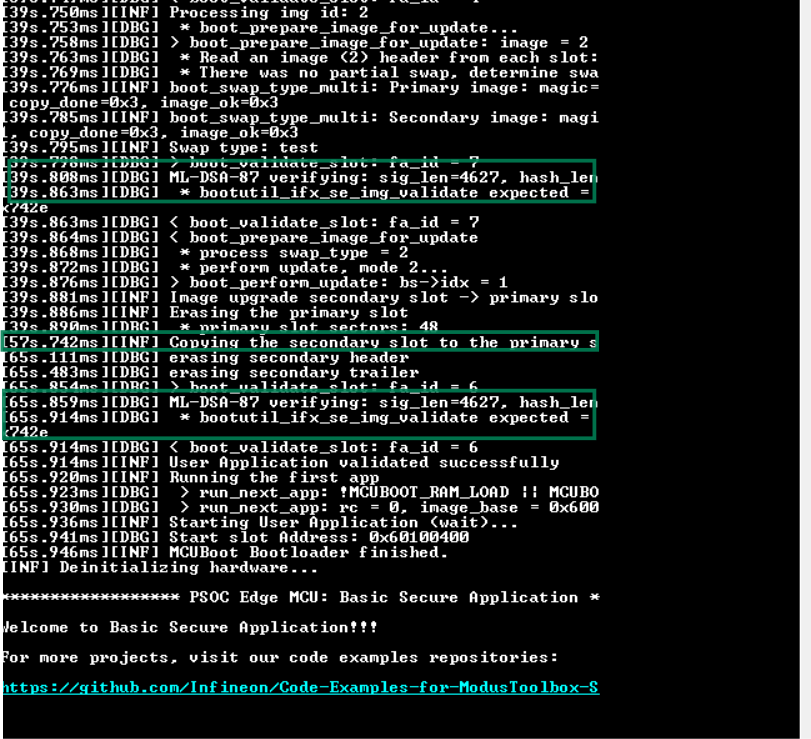


### Use other bootloader capabilities

**PSOC_Edge_Protect_Bootloader** provides several other capabilities including secure boot and secure update with ECDSA P-256 keys, overwrite and swap update mechanism, encrypted boot with AES-128 keys, and loading user application to SRAM, and more. Refer to the application note [Edge Protect Bootloader for PSOC™ Edge MCU](https://www.infineon.com/AN237857) to learn how to configure these features.


### Bootloader integration with LLVM-compiled applications

The Edge Protect Bootloader is not compatible with the LLVM Compiler. However, when you add the bootloader to a code example that utilizes the LLVM Compiler, the bootloader will also be configured to build with LLVM. To resolve this issue, manually override the compiler option in the bootloader’s *Makefile*, as follows:

```
TOOLCHAIN=<GCC_ARM> or <ARM> or <IAR>
```

By configuring the bootloader to use a custom compiler, it will be compiled separately while the application continues to build with the selected LLVM Compiler specified in the *common.mk* file.


## Related resources

Resources  | Links
-----------|----------------------------------
Application notes  | [AN235935](https://www.infineon.com/AN235935) – Getting started with PSOC&trade; Edge E8 MCU on ModusToolbox&trade; software <br> [AN237857](https://www.infineon.com/assets/row/public/documents/30/42/infineon-an237857-edge-protect-bootloader-psoc-edge-applicationnotes-en.pdf) – Edge Protect Bootloader for PSOC&trade; Edge MCU
Code examples  | [Using ModusToolbox&trade;](https://github.com/Infineon/Code-Examples-for-ModusToolbox-Software) on GitHub
Device documentation | [PSOC&trade; Edge E84 MCU datasheet](https://www.infineon.com/products/microcontroller/32-bit-psoc-arm-cortex/32-bit-psoc-edge-arm/psoc-edge-e84#Documents) <br> [PSOC&trade; Edge E84 MCU reference manuals](https://www.infineon.com/products/microcontroller/32-bit-psoc-arm-cortex/32-bit-psoc-edge-arm/psoc-edge-e84#Documents)
Development kits | Select your kits from the [Evaluation board finder](https://www.infineon.com/cms/en/design-support/finder-selection-tools/product-finder/evaluation-board)
Libraries  | [mtb-dsl-pse8xxgp](https://github.com/Infineon/mtb-dsl-pse8xxgp) – Device support library for PSE8XXGP <br> [retarget-io](https://github.com/Infineon/retarget-io) – Utility library to retarget STDIO messages to a UART port
Tools  | [ModusToolbox&trade;](https://www.infineon.com/modustoolbox) – ModusToolbox&trade; software is a collection of easy-to-use libraries and tools enabling rapid development with Infineon MCUs for applications ranging from wireless and cloud-connected systems, edge AI/ML, embedded sense and control, to wired USB connectivity using PSOC&trade; Industrial/IoT MCUs, AIROC&trade; Wi-Fi and Bluetooth&reg; connectivity devices, XMC&trade; Industrial MCUs, and EZ-USB&trade;/EZ-PD&trade; wired connectivity controllers. ModusToolbox&trade; incorporates a comprehensive set of BSPs, HAL, libraries, configuration tools, and provides support for industry-standard IDEs to fast-track your embedded application development

<br>


## Other resources

Infineon provides a wealth of data at [www.infineon.com](https://www.infineon.com) to help you select the right device, and quickly and effectively integrate it into your design.


## Document history

Document title: *CE235379* – *PSOC&trade; Edge MCU: Edge Protect Bootloader*

 Version | Description of change
 ------- | ---------------------
 1.x.0   | New code example <br> Early access release
 2.0.0   | GitHub release
 2.0.1   | Use se-rt-services-utils from BSP
 2.1.0   | SE RAMApp Staging for EPC4 (CM0 RAMApp) support <br>  Code execution from CM33 SRAM and external memory (EPC2, EPC4) <br> Multi-key multi-image XIP encryption (EPC2, EPC4) support  <br> Image encryption with SE RT Services API (EPC4)
 2.2.0   | Added KIT_PSE84_AI kit support 
 2.3.0   | Updated design files to fix ModusToolbox&trade; v3.7 build warnings
 2.4.0   | Added ML-DSA-87 post-quantum signature verification support <br> Configurable signature algorithm (ECDSA-P256 / ML-DSA-87) via Device Configurator
 2.5.0   | Added KIT_PSE84_HMI kit support
<br>


All referenced product or service names and trademarks are the property of their respective owners.

The Bluetooth&reg; word mark and logos are registered trademarks owned by Bluetooth SIG, Inc., and any use of such marks by Infineon is under license.

PSOC&trade;, formerly known as PSoC&trade;, is a trademark of Infineon Technologies. Any references to PSoC&trade; in this document or others shall be deemed to refer to PSOC&trade;.

---------------------------------------------------------

(c) 2025-2026, Infineon Technologies AG, or an affiliate of Infineon Technologies AG. All rights reserved.
This software, associated documentation and materials ("Software") is owned by Infineon Technologies AG or one of its affiliates ("Infineon") and is protected by and subject to worldwide patent protection, worldwide copyright laws, and international treaty provisions. Therefore, you may use this Software only as provided in the license agreement accompanying the software package from which you obtained this Software. If no license agreement applies, then any use, reproduction, modification, translation, or compilation of this Software is prohibited without the express written permission of Infineon.
<br>
Disclaimer: UNLESS OTHERWISE EXPRESSLY AGREED WITH INFINEON, THIS SOFTWARE IS PROVIDED AS-IS, WITH NO WARRANTY OF ANY KIND, EXPRESS OR IMPLIED, INCLUDING, BUT NOT LIMITED TO, ALL WARRANTIES OF NON-INFRINGEMENT OF THIRD-PARTY RIGHTS AND IMPLIED WARRANTIES SUCH AS WARRANTIES OF FITNESS FOR A SPECIFIC USE/PURPOSE OR MERCHANTABILITY. Infineon reserves the right to make changes to the Software without notice. You are responsible for properly designing, programming, and testing the functionality and safety of your intended application of the Software, as well as complying with any legal requirements related to its use. Infineon does not guarantee that the Software will be free from intrusion, data theft or loss, or other breaches (“Security Breaches”), and Infineon shall have no liability arising out of any Security Breaches. Unless otherwise explicitly approved by Infineon, the Software may not be used in any application where a failure of the Product or any consequences of the use thereof can reasonably be expected to result in personal injury.
